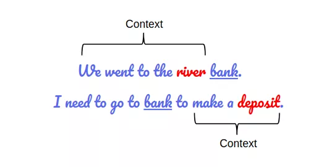
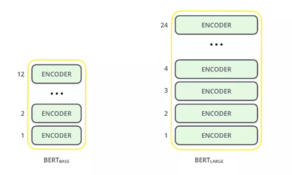
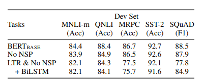

# Tech Review: BERT

## 1. What is BERT？
**BERT (Bidirectional Encoder Representation from Transformers)** is a state-of-the-art language model published and later open source by Google in 2018. BERT performed amazingly well on SQuAD 1.1 tasks with an F1 score of 93.160. BERT is a landmark achievement in the history of NLP development.

## 2. The core ideas behind BERT
The previous language models, such as n-grams models, are limited by the left-to-right or right-to-left direction methods, which made the models not able to extract **non-directional** contextual information from the language. In the following graph, both sentences contain the word 'bank', but they represent completely different meanings, and it would not be correct recognized by normal language models.

BERT is mainly based on **MLM(Masked Language Model)** and **Transformer** and for pre-training and the model structure. **Transformer** can be read more from this [article](https://jalammar.github.io/illustrated-transformer/).

## 3. Framework
As stated in the paper **“BERT: Pre-training of Deep Bidirectional Transformers for
Language Understanding”**, The overall framework of BERT consists of two phases: **Pre-train** and **Fine-tune**. In the pre-train phase, models are trained on unlabeled data. Then for the fine-tune phase, BERT models are first initialized with pre-train model parameters, and then all parameters are tuned with intentional tasks. 

### 3.1 Model Architecture
BERT is based on the Transformer encoders. The [paper](https://arxiv.org/pdf/1810.04805.pdf) introduced BERT(base) and BERT(large).

*BERT-Base: 12-layer, 768-hidden-nodes, 12-attention-heads, 110M parameters*

*BERT-Large: 24-layer, 1024-hidden-nodes, 16-attention-heads, 340M*

### 3.2 Pre-train Phase
The authors of BERT believe that word prediction is best achieved by using information from both directions. Unlike shallow bidirectional models, such as ELMo, BERT wants to train a deep bidirectional model on the Transformer Encoder structure. BERT wants to train a deep bidirectional model based on the Transformer Encoder structure.

### 3.2.1.Masked LM (MLM)
The idea is that the token in each training sequence is randomly replaced with a mask token ([MASK]) with a 15% probability, then predicts the original word at the [MASK] position. However, since [MASK] does not appear in the fine-tuning phase, a mismatch arises between the pre-training and fine-tuning phases. Therefore, BERT employs the following strategy to solve this problem.

*	80% of the tokens are replaced with the token [MASK].
*	10% of the time tokens are replaced with a random token.
*	10% of the time tokens are left unchanged.

### 3.2.2. Next Sentence Prediction (NSP)
For NLP, Question answering is a common task. For this kind of task, we require a language model to understand not only the relationship between tokens but also the relationship between sentences. BERT uses NSP for pre-training. We pass 2 sentences A, B and the job of the model is to tell whether sentence A is followed by sentence B. 50% of the time the model is passed specifically given such B is the actual next sentence after A, and 50% of the time where B is not next sentence after A. These inputs can be pulled from unlabeled text data, which saves many efforts in labeling data.

## 4. Conclusion
To understand what the important factor in BERT is and what made BERT outperform other language models, the paper presented the following results.

We can see that BERT got a lot of improvement with its pre-train phase strategy. Another reason BERT performs so well is that it relies on large amount of dataset, and very expensive training cost.

**Fun fact**: The XLNet model, which beats BERT nowadays costs 245,000 for training. With 512 TPU v3 chips * 2.5 days * $8 a TPU. The cost for BERT is approximately 7000 dollars. 

References:

* https://jalammar.github.io/illustrated-transformer/
* https://arxiv.org/pdf/1810.04805.pdf
* https://gluebenchmark.com/leaderboard/
* https://twitter.com/eturner303/status/1143174828804857856
* https://www.reddit.com/r/MachineLearning/comments/9nfqxz/r_bert_pretraining_of_deep_bidirectional/
